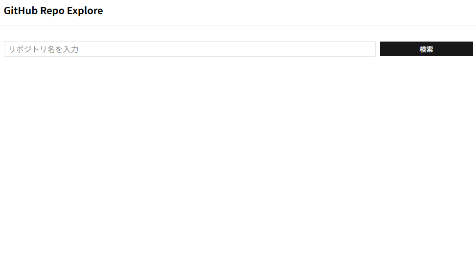
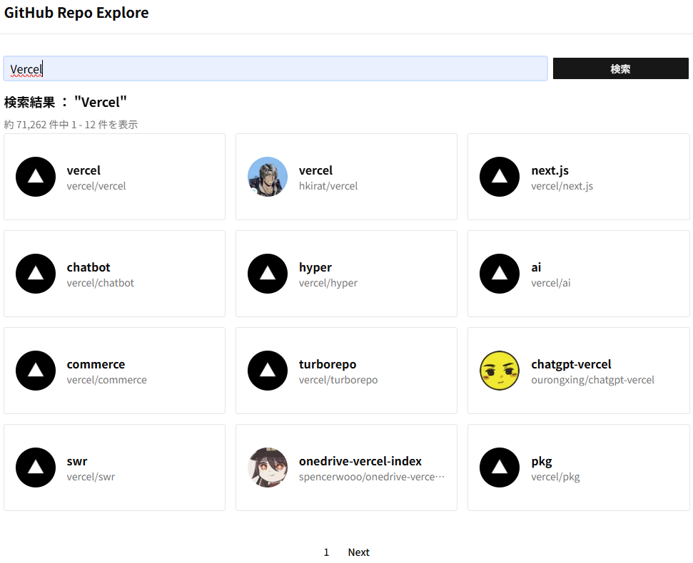
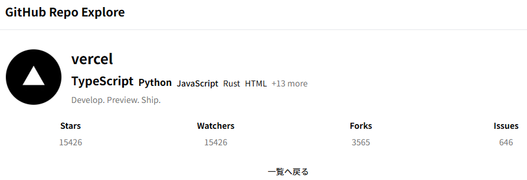

# GitHubリポジトリ検索アプリ





## 概要

リポジトリ名からGitHubのリポジトリを検索するアプリです。

## 必要要件

- Node.js v20以上
- npm

## セットアップ

```bash
# 依存関係のインストール
npm install

# 開発サーバー起動
npm run dev

# ビルド
npm run build

# 本番サーバー起動
npm run start

# リント
npm run lint

# テスト実行
npm run test
```

## 使用技術

| カテゴリ       | 技術                          |
| -------------- | ----------------------------- |
| フレームワーク | Next.js 16 (App Router)       |
| 言語           | TypeScript 5                  |
| UI             | React 19, shadcn/ui, Radix UI |
| スタイリング   | Tailwind CSS 4                |
| フォーム       | React Hook Form 7 + Zod       |
| テスト         | Vitest, Testing Library, MSW  |

### shadcn/ui

アクセシビリティをよくするためにライブラリを用いてます。

### Zod

GitHub APIからのレスポンスをランタイムバリデーションし、型安全性を担保しています。

## ページ構成

| パス                   | 説明                                                  |
| ---------------------- | ----------------------------------------------------- |
| `/`                    | `/search` へリダイレクト                              |
| `/search`              | リポジトリ検索ページ（クエリパラメータ: `q`, `page`） |
| `/repo/[owner]/[repo]` | リポジトリ詳細ページ                                  |

## ディレクトリ構成

```txt
src/
├─ app/ # ルーティング専用
├─ features/ # アプリ特定の機能を含む
│   └─ (feature01)/ # 機能ごとにフォルダ分割
├─ infra/ # 外部APIとの通信処理を管理
├─ shared/ # アプリ共通レイアウト、UIサードパーティライブラリの格納場所
└─ test/ # テストライブラリのセットアップ・e2eの記述場所

```

## 工夫したポイント

### ポイント１：featuresの構成

`features/`の各ディレクトリはContainer/Presentationを用いて **データフェッチ** と **画面表示** を分離するようにしました。UI表示とデータ取得を分離することで表示ロジックの単体テストを容易にしAPI変更の影響範囲を限定できる構成にしました。

ドメイン機能ごとにフォルダを分割するため今後機能が増えた場合は`features/`に適宜追加することで対応が可能。

UI表示の単体テストは **Presentation** に対してテストを行います。APIとの結合テストは **Container** をテストで動作を担保するための構成にしました。Next.js App Routerでは async Server Component を含む構成になるためRTLのみで完全に検証することが難しいケースがあります。そのため、ページ全体の動作保証についてはe2eテストで担保する方針にしました。

またテストコードを同じフォルダに置くことで管理しやすくしました。

```txt
features/
  └─ (feature01)/ # 機能ごとにフォルダ分割
      ├── components/ # Container / Presentation で分割
      │    ├─ feature01Container.tsx # データ取得してPresentationへ引数を渡す
      │    └─ feature01Presentation.tsx # 表示専用（Containerからの引数をもとに表示）
      │    └─ feature01Presentation.test.tsx # 表示ロジックのテスト
      ├── schemas/ # zodによるruntime validationとレスポンス整形
      └── types/ # zod schemaから推論した型定義
```

### ポイント２：app配下をルーティング専用にする

Next.jsのフレームワークの制約上 `app/` にルーティングに関係がないファイルを置かないようにすることで可視性と意図しないバグを避けることを考慮しました。

### ポイント３：Error Handling

GitHub API のステータスコードごとにアプリケーションエラーへ変換し、error.tsx によってユーザー向けエラー表示を統一しています。

| ステータス | エラーコード        | メッセージ                            |
| ---------- | ------------------- | ------------------------------------- |
| 404        | NOT_FOUND           | Repository not found                  |
| 403        | RATE_LIMIT          | GitHub API rate limit exceeded        |
| 422        | BAD_REQUEST         | Invalid search query                  |
| 503        | SERVICE_UNAVAILABLE | GitHub API is temporarily unavailable |

### ポイント４：キャッシュ戦略

GitHub APIへのリクエストは `revalidate: 60` を設定し、60秒間のキャッシュを有効にしています。これによりレート制限への対策と、ユーザー体験の向上を両立しています。

### ポイント５：Skeleton UIによるローディング体験の最適化

Next.js App Routerの `loading.tsx` とSkeleton UIを組み合わせ、データ取得中のUXを最適化しています。

**実装のポイント:**

- **ページ専用のSkeleton**: 検索ページ(`RepositorySearchPageSkeleton`)と詳細ページ(`RepositoryDetailSkeleton`)それぞれに専用のSkeletonを用意し、実際のレイアウトと一致させることでCLS（Cumulative Layout Shift）を防止
- **レスポンシブ対応**: PC表示とスマホ表示で異なるSkeletonレイアウトを適用（例: 詳細ページのアバター画像サイズ、説明文の配置）
- **グリッドレイアウトの維持**: 検索結果一覧では `grid-cols-1 sm:grid-cols-2 lg:grid-cols-3` のグリッド構造をSkeletonでも再現

```typescript
// loading.tsx - Next.jsが自動でSuspense境界として機能
export default function Page() {
  return <RepositorySearchPageSkeleton />;
}
```

### ポイント６：error.tsxによる統一されたエラーリカバリー

Next.js App Routerの `error.tsx` を活用し、エラー発生時のユーザー体験を改善しています。

**実装のポイント:**

- **共通エラーコンポーネント**: `ErrorPageRetry` コンポーネントで全ページ共通のエラー表示とリトライ機能を提供
- **ページ別エラーメッセージ**: 検索ページ（"Failed to load repositories"）と詳細ページ（"Failed to load repository data"）で文脈に応じたメッセージを表示
- **リトライ機能**: `reset()` 関数によりページ全体を再レンダリングせずにServer Componentの再取得が可能
- **エラー詳細の表示**: APIから返されるエラーメッセージ（レート制限、404など）をユーザーに表示

```typescript
// ErrorPageRetry - 再利用可能なエラーリカバリーUI
<div className="flex flex-col items-center gap-4 py-12">
  <p>{error.message}</p>
  <h2>{displayMessage}</h2>
  <Button onClick={() => reset()}>Retry</Button>
</div>
```

## テスト戦略

本プロジェクトでは、テストの粒度を以下のように定義しています。

| テスト種別 | 対象                                     | ツール                  |
| ---------- | ---------------------------------------- | ----------------------- |
| 単体テスト | Presentationコンポーネント、純粋関数     | Vitest, Testing Library |
| 結合テスト | Container + API通信 + Presentation       | Vitest, MSW             |
| E2Eテスト  | 検索・詳細遷移・エラー表示などの主要導線 | 実ブラウザ              |

### MSW (Mock Service Worker)

API通信のモックにMSWを使用しています。`src/test/msw/server.ts` でモックサーバーを定義し、テスト実行時にGitHub APIへのリクエストをインターセプトします。

### テストファイルの配置

コンポーネントのテストファイルはテスト対象と同じディレクトリに配置し、`*.test.tsx` の命名規則に従います。

```txt
components/
├── ComponentName.tsx
└── ComponentName.test.tsx
```
